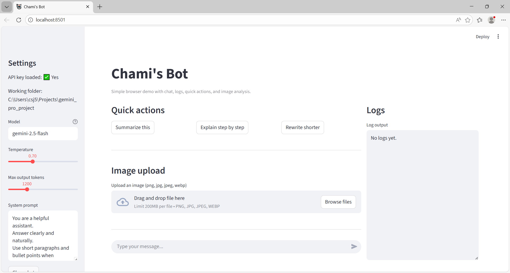

# Chami-s_Bot

🤖 Chami's Bot
This is a fun LLM project built using Google Gemini models and Streamlit, designed as an interactive demo showcasing both conversational AI and multimodal capabilities.

✨ Features

💬 Chat Interface
Interactive chatbot UI using Streamlit
Maintains short conversation history
Clean Markdown-formatted responses

⚡ Quick Actions
Summarize responses
Explain step-by-step
Rewrite shorter

🖼️ Image Analysis (Multimodal)
Upload an image and:
Describe the image
Analyze content
Extract text (OCR)
Combine image + text queries

📊 Logging
Real-time logs panel
Tracks:
User inputs
Model usage
Errors

⚙️ Custom Controls
Model selection
Temperature tuning
Output token control
Editable system prompt

💾 Persistence
Save conversation locally
Export chat as .txt